# **Amplitude Modulation and Demodulation using MATLAB and Hardware Kit**

## **Project Overview**

This project presents an experimental study of amplitude modulation and demodulation using communication trainer kits, oscilloscope waveform observation, and MATLAB simulation.

Amplitude Modulation, commonly known as AM, is one of the oldest and most widely used modulation techniques in communication engineering. In this experiment, a message signal and a carrier signal are combined to generate an amplitude-modulated signal. The modulated signal is then received and demodulated to recover the original message signal.

The project includes both hardware-based waveform observation and MATLAB-based simulation of amplitude modulation under different modulation conditions.

## **Objectives**

* To combine message and carrier frequencies.
* To transmit and receive an amplitude-modulated signal.
* To separate the original message signal through demodulation.
* To understand amplitude modulation and demodulation techniques.
* To observe message, carrier, modulated, and demodulated waveforms using an oscilloscope.
* To simulate amplitude modulation using MATLAB.
* To compare perfect modulation, over modulation, and under modulation conditions

## **Theory**

Amplitude Modulation is a modulation technique in which the amplitude of a high-frequency carrier signal is varied according to the instantaneous amplitude of a low-frequency message signal.

The carrier signal can be represented as:

```text
vc = Vc sin(wc t)
```

The message signal can be represented as:

```text
vm = Vm sin(wm t)
```

The modulation index is defined as:

```text
m = Vm / Vc
```

Where:

* `m` = Modulation index
* `Vm` = Amplitude of the message signal
* `Vc` = Amplitude of the carrier signal

The modulation index determines the type of modulation:

```text
m = 1    → Perfect modulation
m > 1    → Over modulation
m < 1    → Under modulation
```

The amplitude of the modulated signal is given by:

```text
A = Vc + vm
A = Vc + Vm sin(wm t)
A = Vc(1 + m sin(wm t))
```

## **Apparatus**

The following equipment was used in this experiment:

* Oscilloscope: GWINSTEK GOS 6112, 100 MHz
* Amplitude Modulation Transmitter Kit: FALCON ACL-01
* Amplitude Demodulation Receiver Kit: FALCON ACL-02
* Jumper wires
* MATLAB software

## **Block Diagram**

### **Figure 1: Block Diagram for Amplitude Modulation**

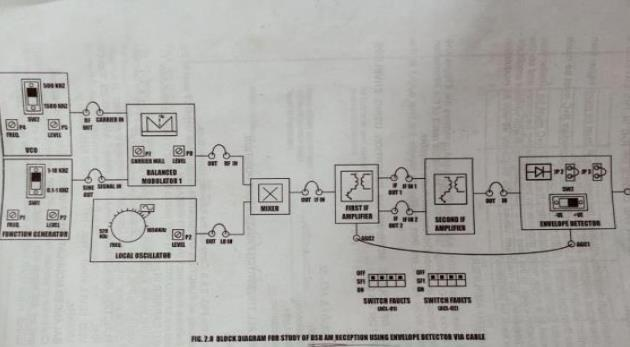


This figure shows the basic block diagram used for studying amplitude modulation generation using the transmitter kit.

### **Figure 2: Block Diagram for Amplitude Demodulation**

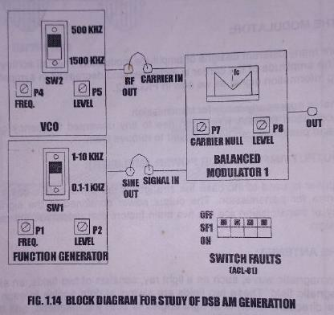


This figure shows the block diagram used for amplitude demodulation and signal recovery using the receiver kit.

## **Hardware Setup**

### **Figure 3: Amplitude Modulation Transmitter Kit**

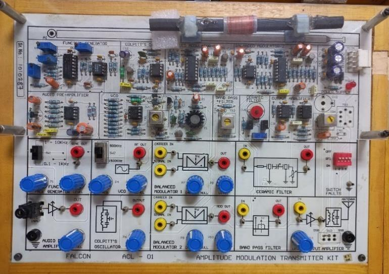


This figure shows the FALCON ACL-01 amplitude modulation transmitter kit used for generating the AM signal.

### **Figure 4: Amplitude Demodulation Receiver Kit**

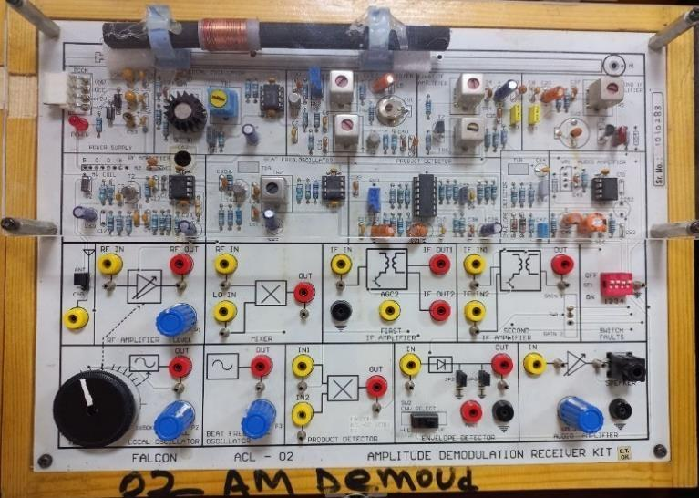


This figure shows the FALCON ACL-02 amplitude demodulation receiver kit used for receiving and demodulating the AM signal.

### **Figure 5: Experimental Setup of Amplitude Modulation and Demodulation**

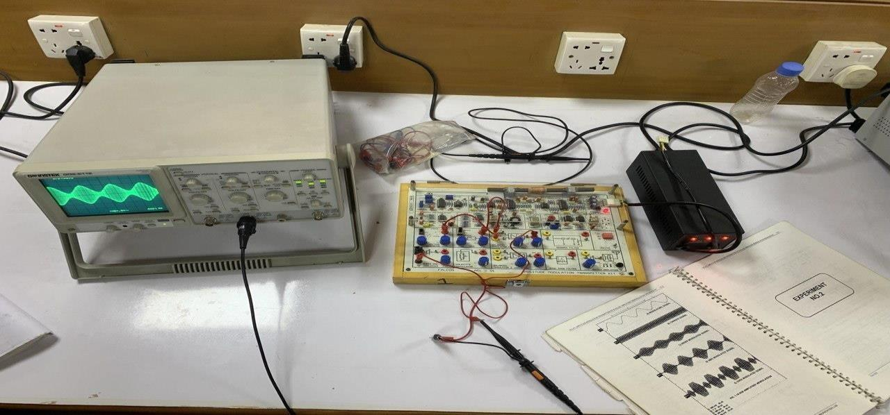


This figure shows the complete experimental setup, including the oscilloscope, communication kit, power supply, and jumper connections.

## **Oscilloscope Waveforms**

### **Figure 6: Message Signal Waveform**

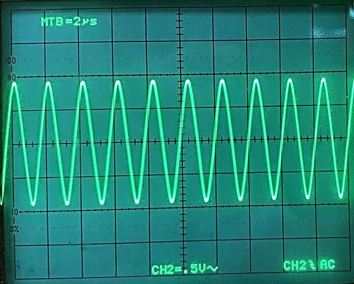


This waveform represents the low-frequency message signal used for amplitude modulation.

### **Figure 7: Carrier Signal Waveform**

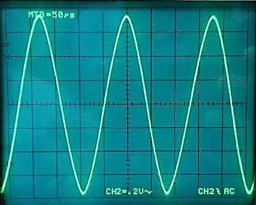


This waveform represents the high-frequency carrier signal used to carry the message signal.

### **Figure 8: Perfectly Modulated Signal Waveform, m = 1**

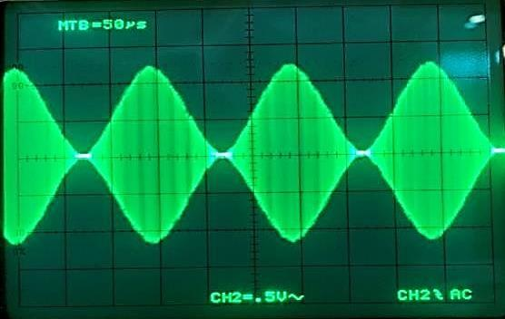


This figure shows the perfectly modulated AM waveform where the modulation index is equal to 1.

### **Figure 9: Over Modulated Signal Waveform, m > 1**

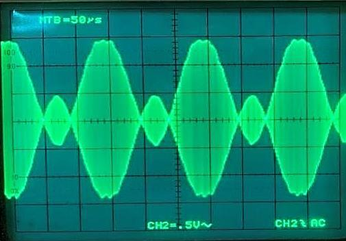


This figure shows the over-modulated AM waveform. In this condition, the modulation index is greater than 1, which causes distortion in the signal envelope.

### **Figure 10: Under Modulated Signal Waveform, m < 1**

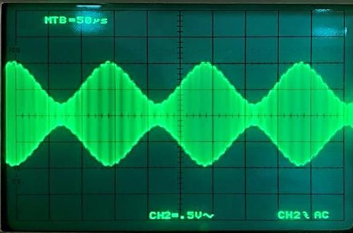


This figure shows the under-modulated AM waveform. In this condition, the modulation index is less than 1.

## **MATLAB Simulation**

The MATLAB simulation was performed to generate and observe the message signal, carrier signal, and amplitude-modulated signal.

The MATLAB code is stored in:

```text
am_modulation_simulation.m
```

## **MATLAB Output Waveforms**

### **Figure 11: MATLAB Output for Perfect Modulation, m = 1**

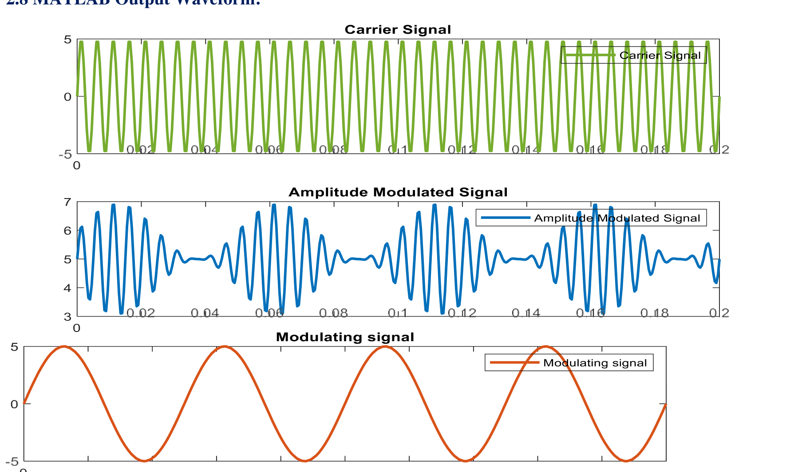


This figure shows the MATLAB simulation output for perfect modulation, where the modulation index is equal to 1.

### **Figure 12: MATLAB Output for Over Modulation, m > 1**

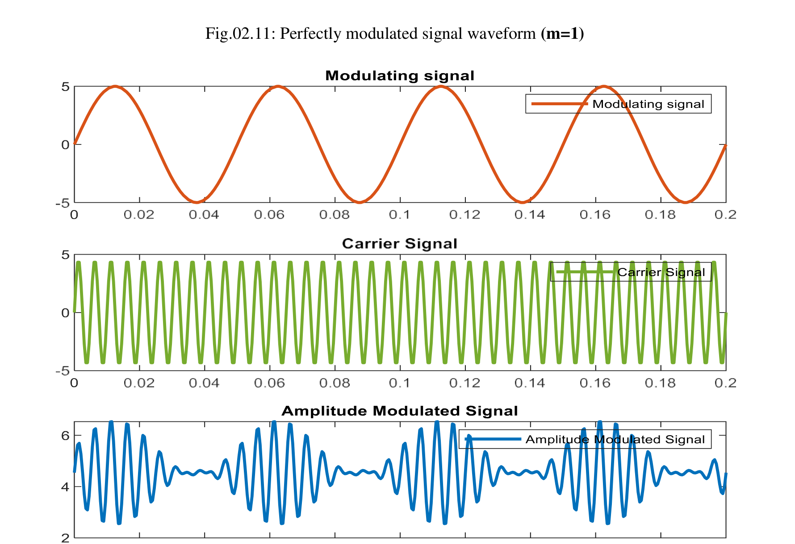


This figure shows the MATLAB simulation output for over modulation, where the modulation index is greater than 1.

### **Figure 13: MATLAB Output for Under Modulation, m < 1**

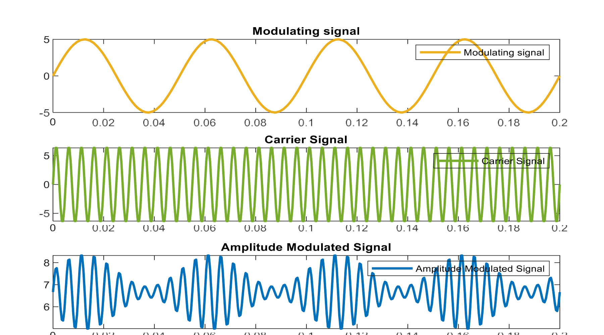


This figure shows the MATLAB simulation output for under modulation, where the modulation index is less than 1.

## **Observation**

From the oscilloscope output, the message signal, carrier signal, and modulated signal were observed successfully. The shape of the modulated signal changed according to the modulation index.

For `m = 1`, the waveform showed perfect modulation.
For `m > 1`, the waveform showed over modulation and envelope distortion.
For `m < 1`, the waveform showed under modulation.

The MATLAB simulation also produced similar waveform patterns for different values of modulation index.

## **Discussion and Conclusion**

In this experiment, amplitude modulation and demodulation techniques were studied using ACL-01 and ACL-02 communication kits. The message signal, carrier signal, modulated signal, and demodulated signal were observed using an oscilloscope.

The experiment also included MATLAB simulation to observe the waveform behavior under perfect modulation, over modulation, and under modulation conditions.

The result confirms that amplitude modulation depends strongly on the modulation index. A modulation index of 1 produces proper modulation, while values greater than 1 cause over modulation and signal distortion. Values less than 1 produce under modulation.

Therefore, the experiment was successfully completed and the basic concept of amplitude modulation and demodulation was verified through both hardware observation and MATLAB simulation.


